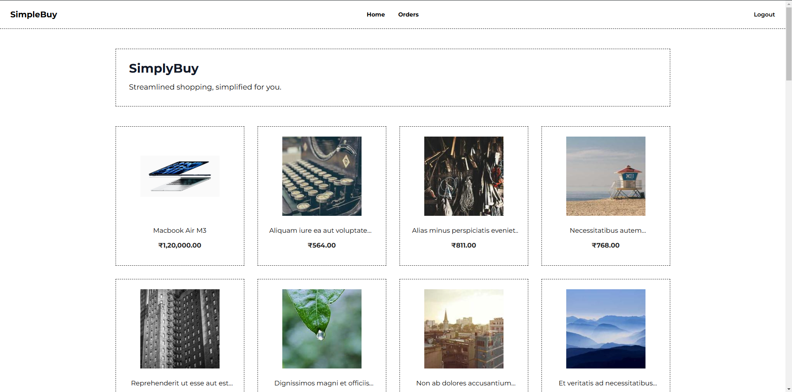
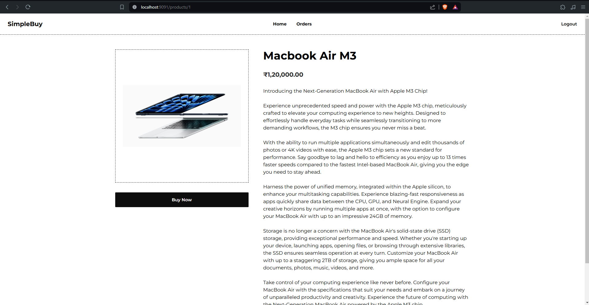

This is very simple project built with Next.js. Backend is built with Go. Payments are handled by Razorpay.
This project is developed for exploration and learning purpose and not meant to used in production in it's current state.

### Screenshots

**Homepage**  
  

**Product page**  
  


### Setup
- Clone the repo ```git clone https://gitlab.com/shivendratechster/next-ecommerce.git```
- Install dependencies ```npm install```
- Copy .env.local from .env.example ```cp .env.example .env.local```
- Run dev server ```npm run dev```
